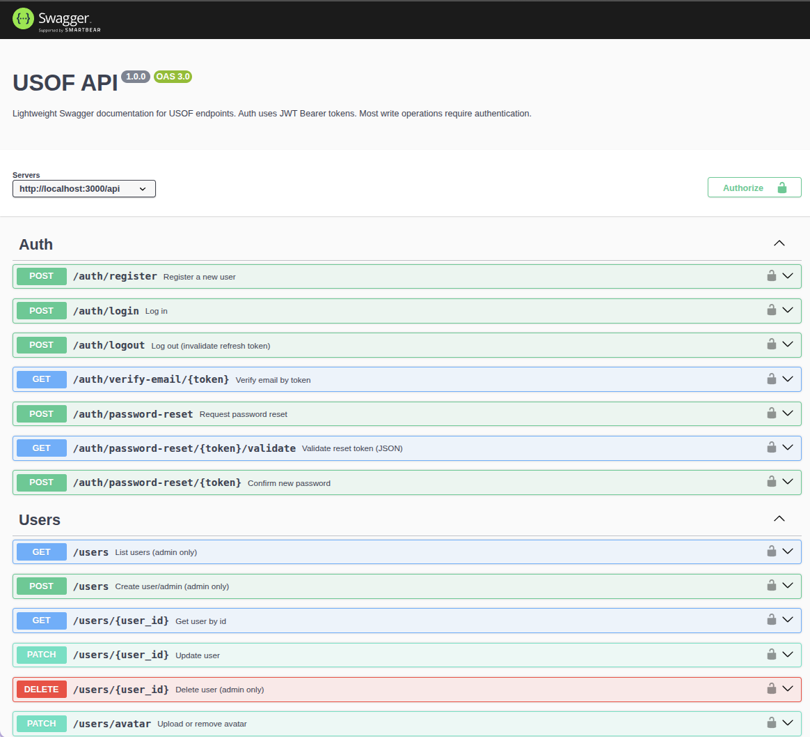
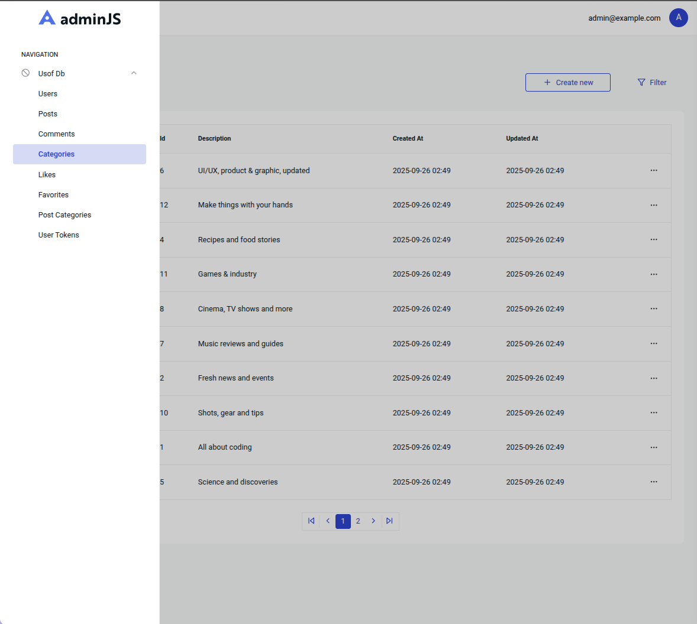
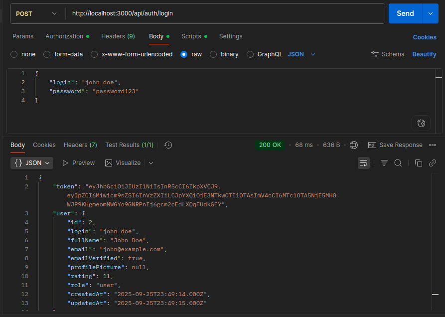

# USOF – Forum Platform API

## 📖 Short Description

USOF is a backend API for a forum platform.  
It provides features such as:

- User authentication and profile management
- Posts, comments, categories, favorites
- Likes/dislikes with automatic rating system
- Admin panel with [AdminJS](https://docs.adminjs.co/)
- REST API with [Swagger](https://swagger.io/) documentation

This project can be used as the backend for a forum-like platform.

---

## 🖼️ Screenshots

- Swagger
  
- AdminJS

- Postman


---

## ⚙️ Requirements and Dependencies

### System Requirements

- **Node.js** v18+
- **npm** v9+
- **MySQL** v8+ (or compatible)

### Dependencies

Main libraries used:

- `express` – web framework
- `mysql2` – MySQL database driver
- `jsonwebtoken` – JWT authentication
- `bcrypt` – password hashing
- `dotenv` – environment variables
- `nodemailer` – email service
- `multer` – file uploads
- `express-session` + `express-mysql-session` – session management
- `swagger-jsdoc` + `swagger-ui-express` – API documentation
- `adminjs`, `@adminjs/sql`, `@adminjs/express` – admin panel

Dev dependency:

- `nodemon` – auto-restart during development

---

## 🚀 How to Run the Project

### 1. Clone repository

```bash
git clone https://github.com/your-username/USOF_back.git
cd USOF_back
```

### 2. Install dependencies

```bash
npm install
```

### 3. Configure environment variables

Create a `.env` file in the root folder and set values like:

```env
DB_HOST=localhost
DB_PORT=3306
DB_USER=your_user
DB_PASSWORD=your_password
DB_NAME=usof_db

JWT_SECRET=your_secret_key
MAIL_HOST=smtp.example.com
MAIL_PORT=587
MAIL_USER=your_email@example.com
MAIL_PASSWORD=your_email_password
```

### 4. Setup database

The project includes npm scripts to manage the database:

```bash
# Create tables
npm run db:create


# Insert initial data (seed)
npm run db:seed

# Drop all tables
npm run db:drop

# Reset database (drop + create + seed)
npm run db:reset
```

### 5. Start the server

```bash
npm start
```

For development with auto-reload:

```bash
npm run dev
```

### 6. Access the app

- API: <http://host:port/api>
- Swagger docs: <http://host:port/api-docs>
- Admin panel: <http://host:port/admin>
